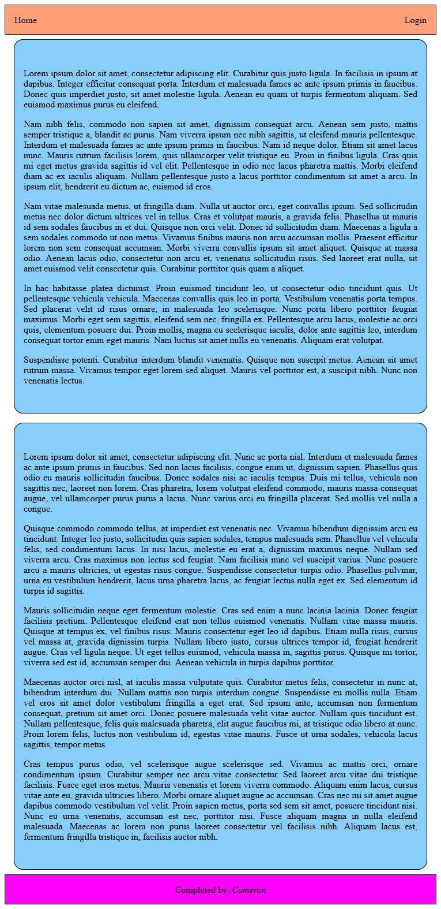
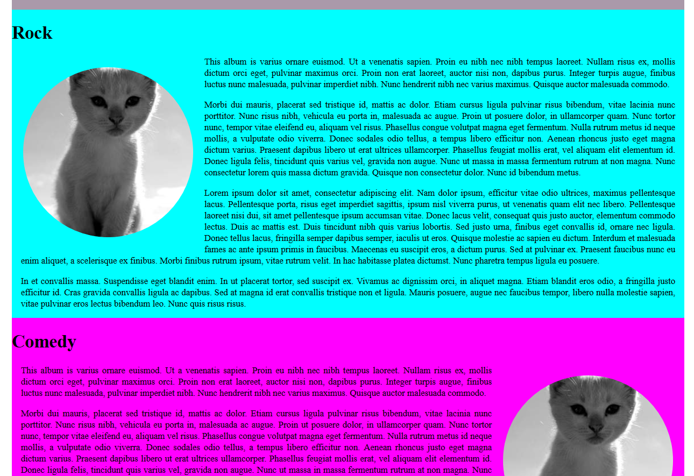

Web Lab 05 &ndash; Responsive Design
==========

Begin by forking this repository into your namespace by clicking the ```fork``` button above, then selecting your username from the resulting window. Once completed, click the ```clone``` button, copy the ```Clone with HTTPS``` value. Open IntelliJ, and from the welcome screen click ```Check out from Version Control -> Git```, then paste the copied URL into the ```URL``` field of the resulting window. Provide your GitLab username and password if prompted.

Explore the files in the project, familiarizing yourself with the content.

When complete, demonstrate your code to your tutor. This must be verified with your tutor by the end of the week.


Note
----

These exercises make use of CSS Grid and CSS Flexbox, which are modern CSS solutions to complex (and simple) layout problems. Historically solutions to these problems would be solved using ```float``` or a library such as Bootstrap so many solutions you find online will revolve around these. Avoid the temptation to use these 'found online' solutions at least for this lab.

Firefox is the preferred browser for developing Grid/Flex based layouts due to its developer tools support for these layouts. Take a look over the Mozilla [introduction to grid layout](https://mozilladevelopers.github.io/playground/css-grid/) tutorial for some grid examples, and a showcase of the Firefox tools specific to these features. 


Exercise One
------------

Begin by creating a new folder ```ictgradschool/web/lab05/ex01``` in your project. In this folder, create 2 files:

+ ```two_col.html```
+ ```style.css```

Using CSS Grid, recreate the following 2 column layout webpage.
 

 
This page is made up of 4 major elements: the header, left column, right column, and footer. 

The header element should be positioned at the top of the page, and should occupy the full width of the viewport. Surround the header with a simple **1px** wide black border, and color it a shade of orange. Inside the element, add 2 text elements containing the words *Home* and *Login*. The *Home* element should be aligned to the left side of the header, and the *Login* to the right. These should be vertically-centered within the header, and should have a small amount of space between the text and the edge of the header. Do **not** use floats for this, investigate the CSS feature ```flexbox```. 

The footer element should be the same height and width as the header, and again should have a simple black border, but the background color should be a shade of purple. Centered both vertically and horizontally, add a text element with the text ```Created by: username```, where ```username``` should be your name. As with the header, do not use floats for this alignment.

The left and right columns should have the same width and height as each-other, and should be centered on the page to the left and right of the center line, with empty space between them and the edge of the viewport. Surround each of these elements with a simple black border that has a moderate radius on each corner. Each column should be colored a shade of blue. Fill these columns with some placeholder Lorem Ipsum text, then style this so that the text is justified and has suitable space between the text and edge of the column.


Exercise Two
------------

Make a copy of your ```ex01``` folder and name the copied folder ```ex02```. Modify your ```ex02/style.css``` so that when the browser displaying the ```ex02/two_col.html``` file is resized so that its width is less than **1000px**, the layout converts to a stacked-column layout, with each column of text occupying the full width of the page. This should look something like the following picture.



*_HINT_*: This can be done with a single media query modifying only the **```grid-template-*```** properties of your CSS Grid container.


Exercise Three
--------------

Open ```ex03/sonnets.html``` and edit the style block with media queries so that:

+ The decorative corner images are only shown on screens larger than 1500px wide
+ On screens narrower than 700px, **remove**:
  - The drop shadow from the page elements
  - The curved corners on the page
  - The vertical scroll decorations
  - Any horizontal padding
+ When printing, ensure that the page follows the characteristics described in the provided lab resource document


Exercise Four
--------------

Start by creating a new folder ```ictgradschool/web/lab05/ex04``` in your project. In this folder, create 2 files:

+ ```music_store.html```
+ ```style.css```

In these files you will create the structure and styling for a responsive CSS Grid based music store. In this website you will display information about 3 genres of music that you may choose; for each showing album art for a single album along with some details about the album, and some information about the associated artist.

Begin by copying the contents of the ```example06/index.html``` into your ```music_store.html``` file, and copying the ```example06/res``` directory into the ```ex04``` directory. This will give you a starting point to begin your layout, and will give you a responsive navigation bar.

Extract the CSS from the head of your ```music_store.html``` document and relocate it to the ```style.css``` file - remember to ```link``` the style file back to the HTML. Familiarize yourself with the contents of both of these files to get a feel for how it works - you will be modifying this to suit your own purposes. 

Modify your navigation bar so that the **brand** text - the content to the left of the navigation bar - so that it contains the text ```My Music Store``` and has a larger font size than is there by default. Further modify the links in the navigation bar so that they indicate the 3 genres you will displaying on your store. Modify the color of the navbar to something nicer than the default.

Add a footer to your document that spans the full width of the page, and is placed underneath the content of the page. This footer should have the same height and color as the navigation bar, and should have your name centered vertically and horizontally within in a contrasting color. *HINT*: You will want to modify the grid layout to accommodate the new footer, and take advantage of flexbox to position your name within the footer.

At this stage your page should look similar to this:


Exercise Five
--------

Make a copy of your ```ex04``` directory, naming your copy ```ex05```. Close all open editor tabs and reopen them from the ```ex05``` directory.

Break up the content pane into 4 rows stacked vertically. Each of these rows should be sized based on the height of the contents contained within, and should be colored clearly so they can be easily seen. Within each of these rows, add a larger header that contains a title for each section - the first should be called ```Introduction```, while each of the others should be named after your chosen genres. Update the navigation bar so that when a navigation item is clicked, the page scrolls to the relevant section of the page.

Populate the ```Introduction``` section with 5 paragraphs of lorem ipsum text placed underneath the header. Justify the text and add some padding to make the content look pleasant. Insert a logo of your choice between your filler text and the Introduction header, ensuring that the size looks reasonable on the page. Modify the ```Introduction``` row so that elements are aligned on the vertical axis

At this stage your page should look similar to this:


Exercise Six
--------

Make a copy of your ```ex05``` directory, naming your copy ```ex06```. Close all open editor tabs and reopen them from the ```ex06``` directory.

Modify each of your 3 genre rows so that underneath the header an image will appear side-by-side with 4 paragraphs of text. The image should contain some album art (or a filler image). Modify the image so that it appears to be circular - *HINT*: look into ```border-radius```. 

You should alternate the positions of the images in your genre rows so that they are positioned on the left then the right.

When complete, each genre block should look similar to the below.




Exercise Seven
--------

Make a copy of your ```ex06``` directory, naming your copy ```ex07```. Close all open editor tabs and reopen them from the ```ex07``` directory.

Make the necessary changes to the ```style.css``` file so that if the width of the window drops below 1000px, the content rows occupy the full-width of the window with no whitespace around them.

Make further changes so that when the width of the window drops below 768px, the horizontal album image and text contents transform so that the image appears below the album text, but above the following lorem ipsum text.

When complete, your page may look something like this.


Extension [Optional]
---------

The navigation bar as provided remains at the top of the document, allowing us to scroll past it. This is not particularly useful for a navbar that contains links to other parts of the document, so we would like to fix that. 

Make the necessary changes to the HTML/CSS so that the navigation bar 'sticks' to the top of the viewport. While doing this, ensure that the proportions of other elements (foorter, content, etc) remain as they were, and that no content is stuck behind the navbar when you are viewing at the top of the page.

Experiment with the colors and formatting of the page to accomplish a more appealing look.